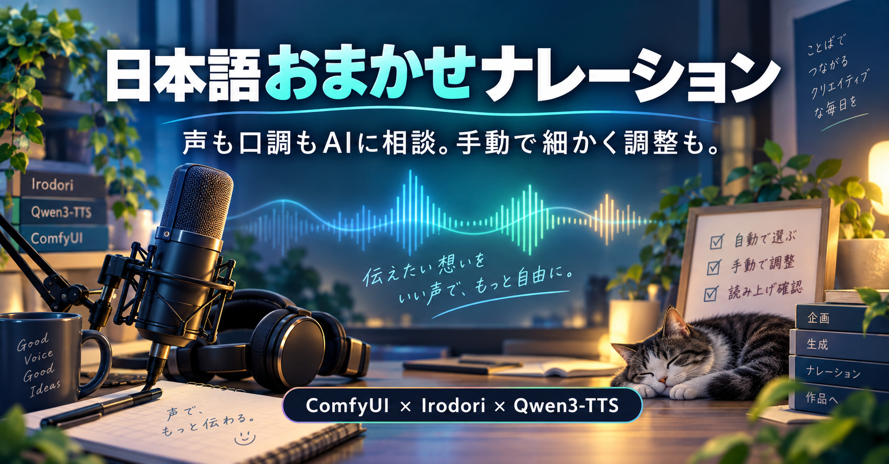
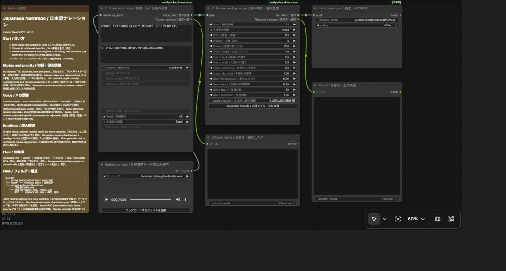
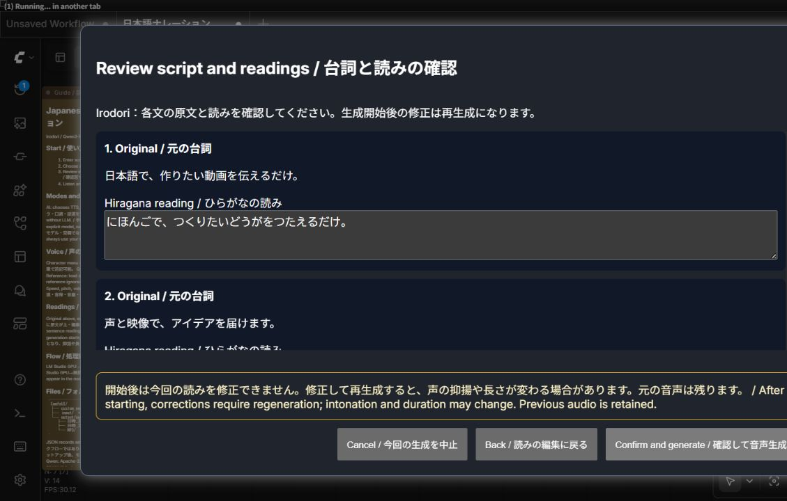

# Local Japanese Narration / 日本語おまかせナレーション

One ComfyUI workflow for Irodori and Qwen3-TTS, with AI/manual control and pronunciation review. / IrodoriとQwen3-TTSを1本で切り替え、AIおまかせ・手動設定・生成前の読み確認を使えるComfyUIワークフローです。





## Download / 入手

Download the ZIP from [Releases](https://github.com/FURUYAN1234/ComfyUI-Local-Narration-Japanese/releases/latest). / リリースからZIPを入手してください。
The ZIP includes the workflow, custom node and setup scripts; models are downloaded separately. / ZIPにはワークフロー・カスタムノード・セットアップ処理を同梱し、モデルは別途取得します。

## Requirements / 必要な環境

The supported setup is Linux or Ubuntu on WSL2, Python 3.10–3.12, NVIDIA CUDA GPU and a working ComfyUI installation. / 対象はLinuxまたはWSL2のUbuntu、Python 3.10〜3.12、NVIDIA CUDA GPU、導入済みのComfyUIです。
The tested configuration has 16 GB VRAM; this is not a guaranteed minimum. / 検証環境のVRAMは16GBです。必要最小量を保証する値ではありません。
Install Git, FFmpeg, SoX and venv support. / Git・FFmpeg・SoX・venvを用意してください。

```bash
sudo apt update
sudo apt install git ffmpeg sox python3-venv
```

AI mode additionally needs LM Studio, its `lms` CLI and the `qwen/qwen3.5-9b` model. / AIモードではLM Studio、lms CLI、qwen/qwen3.5-9bモデルも必要です。
Manual mode does not use LM Studio. / 手動モードではLM Studioを使いません。
Download the LLM inside LM Studio before using AI mode. / AI利用前にLM Studio側でLLMを取得してください。
`LOCAL_NARRATION_LMS_CLI` can point to the CLI, and `LOCAL_NARRATION_LM_ENDPOINT` can override the API URL. / CLIの場所とAPI接続先は左記の環境変数で指定できます。
Windows LM Studio is detected from its standard installation on WSL. / WSLではWindows版LM Studioの標準配置を検出します。

## Install / 導入

Extract the ZIP, open its directory in Ubuntu, and replace the example ComfyUI path with yours. / ZIPを展開し、Ubuntuで展開先を開いて、例のComfyUIパスを自分の配置先に置き換えます。

```bash
python3 install.py --comfyui /path/to/ComfyUI
```

The installer creates separate environments for the two incompatible Transformers versions. / 互換性の異なるTransformersを分離するため、2つの専用環境を作ります。
Initial setup downloads Python packages and CUDA libraries and may take time and substantial disk space. / 初回はPythonパッケージとCUDAライブラリを取得するため、時間とディスク容量を使います。
Restart ComfyUI and open `03_音声/18_音声_ローカルナレーション/日本語ナレーション_TTS切替_AI・手動`. / ComfyUIを再起動し、左記のワークフローを開きます。
Press **Download models / 必須モデル一式を取得** on the generation node. / 音声生成ノードのモデル取得ボタンを押してください。
It downloads pinned Irodori, codec, watermark and Qwen model files; cached files are reused. / 指定版のIrodori・コーデック・透かし・Qwenモデルを取得し、取得済みファイルは再利用します。
Status appears in the node title, and failures are shown instead of reporting success. / ノード見出しに進捗を表示し、失敗時はエラーを表示します。
For CLI download after setup: / セットアップ後に端末で取得する場合：

```bash
/path/to/ComfyUI/custom_nodes/comfyui-local-narration/runtime/envs/irodori/bin/python \
  /path/to/ComfyUI/custom_nodes/comfyui-local-narration/runtime/download_models.py
```

The placeholder audio is silence and is ignored outside reference mode. / 初期参照音声は無音のプレースホルダーで、参照モード以外では使用しません。
Upload your own suitable reference before selecting Reference. / 参照モードを選ぶ前に、使用する参照音声をアップロードしてください。

## Use / 使い方

1. Enter the complete script and the intended use. / 読み上げる原稿全文と用途を入力します。
2. Choose AI, Manual, or AI + manual override. / AIおまかせ・手動・AI提案＋手動上書きから選びます。
3. Run, review each sentence and its reading, then generate. / 実行して各文と読みを確認し、音声生成へ進みます。
4. Listen on the right and save MP3. / 右側で試聴してMP3を保存します。

AI chooses TTS, voice character, tone and speed according to the content. / AIは内容に合わせてTTS・声キャラ・口調・話速を選びます。
Manual lets you select TTS and a character from node menus, plus additional style text. / 手動ではノードのメニューでTTSと声キャラを選び、文章で追加指定できます。
The character provides a base description; extra style text is appended and should not contradict it. / 声キャラを基本説明とし、追加指定を追記します。矛盾する指定は避けてください。
Qwen also offers nine fixed speakers through CustomVoice. / QwenではCustomVoiceの9話者も選べます。
Reference mode uses recorded speech; Qwen Base does not apply style instructions. / 参照モードは音声を使い、Qwen Baseでは口調の文章指定は適用されません。
AI + override prioritizes a specified TTS, character/style and nonzero speed. / AI＋上書きでは、指定TTS・声キャラや口調・0以外の話速を優先します。
The original script is preserved; the confirmed reading is sent to TTS. / 原稿は保持し、確認した読みをTTSへ渡します。

## Dialogue blocks (manual) / 台詞ブロック（手動）

Choose Manual and click Dialogue blocks on the direction node. / 手動を選び、原稿ノードの「台詞ブロックを編集」を押します。
Use + to append a block, - to remove it, and Undo remove to restore the last removed block. / ＋で末尾に追加、－で削除、削除を戻すで直前の削除を取り消します。
At least one block is retained; enter text in empty blocks before generation. / 最低1ブロックを残します。生成前に空の台詞を入力してください。
Each block can contain multiple sentences; selected blocks still pass through pronunciation review. / 1ブロックに複数の文を入れられ、生成対象の台詞は読み確認を通ります。
Generate one block or all blocks; each has its own audio player and MP3 download. / 台詞単位または全台詞を生成でき、各ブロックで再生・MP3保存できます。
Voice and detailed settings are shared across blocks. / 声と詳細設定は全ブロック共通です。
Names use a three-digit index plus the first 40 characters of the original text, with unsafe filename characters replaced. / 名前は3桁の通し番号＋元の台詞の先頭40文字とし、ファイル名に使えない文字は置換します。
Example: `001_こんにちは。.mp3`; each run has a unique output directory, preserving previous audio. / 例：`001_こんにちは。.mp3`。実行ごとに別フォルダーへ保存し、以前の音声を残します。
Outputs are under `output/audio/LocalNarration/Blocks/`; `blocks.json` is the result record, not a workflow. / 左記の配下へ保存し、blocks.jsonは結果記録で、ワークフローではありません。
Editing text marks the player as previous-text audio until regenerated. / 台詞編集後は、再生成するまで変更前の音声であることを表示します。
Block text and playback links are saved with the workflow; save the workflow before closing the browser. / 台詞と再生リンクはワークフローに保存されます。ブラウザーを閉じる前にワークフローを保存してください。
AI modes keep using the original script field; manual blocks are retained but not used. / AIモードでは通常の原稿欄を使い、手動ブロックは保持されますが使用しません。

## Pronunciation review / 読み確認



Every sentence appears with the original above and editable hiragana below. / 全文を文ごとに、原文が上・編集できるひらがなが下に表示します。
Automatic conversion can misread names or context-dependent words; correct them before generation. / 自動変換は人名や文脈で読みが変わる語を誤る場合があるため、生成前に修正してください。
The memory checkbox saves edited sentence readings locally for reuse. / 記憶チェックで修正した文の読みをローカル保存し、次回に再利用します。
A confirmation warns that changes after generation starts require a new generation. / 開始前に、開始後の修正は再生成になることを確認します。
Regeneration may change intonation and duration; previous audio files remain. / 再生成で抑揚や長さが変わる場合があります。元の音声ファイルは残ります。
Cancel is on the left and Generate on the right. / 中止は左、生成は右に配置しています。

## Tuning and outputs / 調整と出力

Adjust speed, pitch, volume, pauses, Irodori steps/guidance and Qwen sampling. / 話速・音程・音量・間・Irodoriのステップと各強度・Qwenのサンプリングを調整できます。
Engine-specific settings affect only the selected engine. / モデル固有の設定は該当モデルだけに作用します。
Long text is split; subsequent designed-voice chunks use the first generated voice as reference. / 長文は分割し、声のデザイン時は最初の声を後続区間の参照に使います。
LM Studio runs on GPU and releases it before TTS generation. / LM StudioをGPUで実行し、解放してからTTSを生成します。

```text
ComfyUI/
├─ custom_nodes/comfyui-local-narration/
│  └─ runtime/
│     ├─ config.json
│     ├─ envs/
│     └─ private/narration_readings.json
├─ input/                         # reference audio / 参照音声
├─ user/default/workflows/03_音声/18_音声_ローカルナレーション/
└─ output/audio/LocalNarration/
   ├─ 日時_ID/                    # audio.wav, request.json, result.json
   └─ MP3/                        # playback and download / 再生・保存
```

Output JSON files record the script, readings, settings and result; they are not workflow JSON. / 出力JSONは原稿・読み・設定・結果の記録で、ワークフローとして読み込むものではありません。
Keep generated WAV as a future voice reference. / 生成WAVを次回の声の参照に利用できます。
Do not include personal dictionaries, input audio or local configuration when redistributing. / 再配布時は個人の辞書・入力音声・ローカル設定を含めないでください。

## Models and licenses / モデルとライセンス

Integration code: Apache-2.0. / 連携コードはApache-2.0です。

- [Irodori-TTS v4.1-Small](https://huggingface.co/Aratako/Irodori-TTS-v4.1-Small): MIT; follow the model card's additional usage restrictions, including consent for impersonation. / MIT。なりすましに関する同意要件など、モデルカードの追加利用条件も確認してください。
- [Qwen3-TTS](https://github.com/QwenLM/Qwen3-TTS): 1.7B VoiceDesign, CustomVoice and Base; Apache-2.0. / 1.7BのVoiceDesign・CustomVoice・Baseを使用。Apache-2.0です。
- [Irodori inference code](https://github.com/Aratako/Irodori-TTS), [DACVAE](https://github.com/facebookresearch/dacvae), [SilentCipher](https://github.com/SesameAILabs/silentcipher): downloaded from their projects; licenses remain with them. / 各プロジェクトから取得し、それぞれのライセンスが適用されます。

## Validation / 検証

Real GPU runs covered Irodori, Qwen preset/reference, long-text voice reuse and LM Studio automatic selection. / 実GPUでIrodori・Qwen既定話者と参照・長文の声再利用・LM Studio自動選択を検証しています。
Pronunciation still requires listening; ASR matching alone does not prove naturalness. / 発音は試聴が必要です。ASR一致だけで自然さを保証しません。
The initial environment setup was checked with existing compatible environments; a different PC may require CUDA or system-package adjustments. / 初期設定は既存の互換環境を指定して検証しており、別PCではCUDAやシステムパッケージの調整が必要な場合があります。

## Version / バージョン

v1.0.0: unified TTS selection, AI/manual control, character menu, reading review and model download. / TTS切替・AI/手動・声キャラメニュー・読み確認・モデル取得を統合。